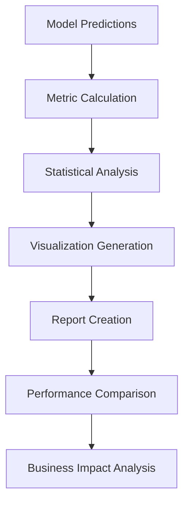

# Evaluation System Documentation

The evaluation system provides comprehensive model assessment capabilities with 15+ metrics, advanced visualizations, and detailed performance analysis. This document covers all evaluation features, from basic metrics to advanced analysis techniques.

## 📊 Overview

### Evaluation Components



### Key Features

- **15+ Evaluation Metrics**: Classification, probability, and business metrics
- **Advanced Visualizations**: ROC curves, precision-recall curves, confusion matrices
- **Statistical Analysis**: Confidence intervals, significance testing
- **Feature Importance**: Model-agnostic and model-specific importance
- **Error Analysis**: Detailed error pattern analysis
- **Business Metrics**: Cost-sensitive evaluation and profit analysis

## 🎯 Core Evaluation Metrics

### Classification Metrics

```python
from evaluate import ModelEvaluator

evaluator = ModelEvaluator()

# Basic classification metrics
basic_metrics = evaluator.calculate_classification_metrics(
    y_true=y_test,
    y_pred=predictions,
    y_prob=probabilities
)

print(f"Accuracy: {basic_metrics['accuracy']:.4f}")
print(f"Precision: {basic_metrics['precision']:.4f}")
print(f"Recall: {basic_metrics['recall']:.4f}")
print(f"F1-Score: {basic_metrics['f1']:.4f}")
```

### Probability-Based Metrics

```python
# Probability metrics for better model assessment
prob_metrics = evaluator.calculate_probability_metrics(
    y_true=y_test,
    y_prob=probabilities
)

print(f"ROC-AUC: {prob_metrics['roc_auc']:.4f}")
print(f"PR-AUC: {prob_metrics['pr_auc']:.4f}")
print(f"Log Loss: {prob_metrics['log_loss']:.4f}")
print(f"Brier Score: {prob_metrics['brier_score']:.4f}")
```

### Complete Metrics Suite

| Metric Category | Metrics | Description |
|----------------|---------|-------------|
| **Classification** | Accuracy, Precision, Recall, F1-Score | Basic classification performance |
| **Probability** | ROC-AUC, PR-AUC, Log Loss, Brier Score | Probability calibration quality |
| **Threshold** | Balanced Accuracy, Matthews Correlation | Threshold-independent metrics |
| **Business** | Cost-Sensitive Accuracy, Profit Score | Business impact metrics |
| **Statistical** | Confidence Intervals, P-values | Statistical significance |

## 📈 Advanced Evaluation

### Comprehensive Model Evaluation

```python
# Complete evaluation with all metrics
results = evaluator.comprehensive_evaluation(
    model=trained_model,
    X_test=X_test,
    y_test=y_test,
    include_plots=True,
    save_results=True
)

# Access all metrics
print("Classification Metrics:")
for metric, value in results['classification'].items():
    print(f"  {metric}: {value:.4f}")

print("\nProbability Metrics:")
for metric, value in results['probability'].items():
    print(f"  {metric}: {value:.4f}")
```

### Cross-Validation Evaluation

```python
# Cross-validation with detailed statistics
cv_results = evaluator.cross_validation_evaluation(
    model=model,
    X=X_train,
    y=y_train,
    cv_folds=5,
    scoring=['roc_auc', 'f1', 'precision', 'recall'],
    return_train_score=True
)

# View CV statistics
for metric in cv_results['test_scores']:
    scores = cv_results['test_scores'][metric]
    print(f"{metric}: {scores.mean():.4f} ± {scores.std():.4f}")
```

### Stratified Evaluation

```python
# Evaluation by data segments
stratified_results = evaluator.stratified_evaluation(
    model=model,
    X_test=X_test,
    y_test=y_test,
    stratify_by=['customer_segment', 'tenure_group'],
    metrics=['roc_auc', 'f1', 'precision', 'recall']
)

# View segment performance
for segment, metrics in stratified_results.items():
    print(f"\nSegment: {segment}")
    for metric, value in metrics.items():
        print(f"  {metric}: {value:.4f}")
```

## 📊 Visualization System

### ROC and Precision-Recall Curves

```python
# Generate performance curves
curves = evaluator.plot_performance_curves(
    y_true=y_test,
    y_prob=probabilities,
    model_name="XGBoost",
    save_plots=True
)

# Multiple model comparison
evaluator.plot_multiple_roc_curves(
    models_data={
        'Logistic': (y_test, prob_logistic),
        'Random Forest': (y_test, prob_rf),
        'XGBoost': (y_test, prob_xgb)
    },
    save_path='metrics/roc_comparison.png'
)
```

### Confusion Matrix Analysis

```python
# Enhanced confusion matrix
confusion_analysis = evaluator.plot_confusion_matrix(
    y_true=y_test,
    y_pred=predictions,
    normalize='true',  # or 'pred', 'all', None
    include_percentages=True,
    save_plot=True
)

# Multi-threshold confusion matrices
evaluator.plot_threshold_analysis(
    y_true=y_test,
    y_prob=probabilities,
    thresholds=[0.3, 0.5, 0.7],
    save_plots=True
)
```

### Feature Importance Visualization

```python
# Model-specific feature importance
importance_plot = evaluator.plot_feature_importance(
    model=trained_model,
    feature_names=feature_names,
    importance_type='gain',  # or 'weight', 'cover'
    top_n=20,
    save_plot=True
)

# Permutation importance (model-agnostic)
perm_importance = evaluator.plot_permutation_importance(
    model=trained_model,
    X_test=X_test,
    y_test=y_test,
    n_repeats=10,
    random_state=42
)
```

### Calibration Analysis

```python
# Probability calibration plots
calibration_plot = evaluator.plot_calibration_curve(
    y_true=y_test,
    y_prob=probabilities,
    n_bins=10,
    strategy='quantile',
    save_plot=True
)

# Reliability diagram
reliability_plot = evaluator.plot_reliability_diagram(
    y_true=y_test,
    y_prob=probabilities,
    n_bins=10
)
```

## 🔍 Error Analysis

### Prediction Error Analysis

```python
# Detailed error analysis
error_analysis = evaluator.analyze_prediction_errors(
    model=trained_model,
    X_test=X_test,
    y_test=y_test,
    feature_names=feature_names,
    include_shap=True
)

# Error patterns by feature values
error_patterns = evaluator.analyze_error_patterns(
    X_test=X_test,
    y_test=y_test,
    predictions=predictions,
    probabilities=probabilities,
    categorical_features=['gender', 'contract_type']
)
```

### Misclassification Analysis

```python
# Analyze misclassified samples
misclassified = evaluator.analyze_misclassifications(
    X_test=X_test,
    y_test=y_test,
    predictions=predictions,
    probabilities=probabilities,
    top_n=50
)

# Feature distributions for errors
error_distributions = evaluator.plot_error_feature_distributions(
    X_test=X_test,
    y_test=y_test,
    predictions=predictions,
    features_to_analyze=['monthly_charges', 'tenure', 'total_charges']
)
```

### Confidence Analysis

```python
# Prediction confidence analysis
confidence_analysis = evaluator.analyze_prediction_confidence(
    probabilities=probabilities,
    y_true=y_test,
    confidence_thresholds=[0.6, 0.7, 0.8, 0.9]
)

# High/low confidence performance
confidence_performance = evaluator.evaluate_by_confidence(
    y_true=y_test,
    y_pred=predictions,
    y_prob=probabilities,
    confidence_bins=5
)
```

## 💼 Business Impact Evaluation

### Cost-Sensitive Evaluation

```python
# Define business costs
cost_matrix = {
    'true_positive': -100,   # Revenue saved by preventing churn
    'false_positive': -10,   # Cost of unnecessary retention effort
    'true_negative': 0,      # No cost for correct non-churn prediction
    'false_negative': -500   # Revenue lost from missed churn
}

# Calculate business metrics
business_metrics = evaluator.calculate_business_metrics(
    y_true=y_test,
    y_pred=predictions,
    y_prob=probabilities,
    cost_matrix=cost_matrix
)

print(f"Expected Profit: ${business_metrics['expected_profit']:,.2f}")
print(f"Cost per Customer: ${business_metrics['cost_per_customer']:.2f}")
```

### Profit Curve Analysis

```python
# Generate profit curves
profit_analysis = evaluator.plot_profit_curves(
    y_true=y_test,
    y_prob=probabilities,
    cost_matrix=cost_matrix,
    population_size=10000,
    save_plot=True
)

# Optimal threshold for business metrics
optimal_threshold = evaluator.find_optimal_threshold(
    y_true=y_test,
    y_prob=probabilities,
    metric='profit',
    cost_matrix=cost_matrix
)

print(f"Optimal Threshold: {optimal_threshold:.3f}")
```

### ROI Analysis

```python
# Return on Investment analysis
roi_analysis = evaluator.calculate_roi_metrics(
    y_true=y_test,
    y_prob=probabilities,
    customer_values=customer_lifetime_values,
    intervention_costs=retention_costs,
    success_rates=retention_success_rates
)

print(f"Expected ROI: {roi_analysis['roi']:.2%}")
print(f"Break-even Threshold: {roi_analysis['breakeven_threshold']:.3f}")
```

## 📋 Model Comparison

### Multi-Model Evaluation

```python
# Compare multiple models
models_to_compare = {
    'Logistic Regression': logistic_model,
    'Random Forest': rf_model,
    'XGBoost': xgb_model,
    'LightGBM': lgb_model
}

comparison_results = evaluator.compare_models(
    models=models_to_compare,
    X_test=X_test,
    y_test=y_test,
    metrics=['roc_auc', 'f1', 'precision', 'recall'],
    include_statistical_tests=True
)

# View comparison table
print(comparison_results['summary_table'])
```

### Statistical Significance Testing

```python
# Test for significant differences
significance_tests = evaluator.statistical_significance_tests(
    model_results=comparison_results,
    alpha=0.05,
    correction='bonferroni'
)

# View significance matrix
print("Statistical Significance (p-values):")
print(significance_tests['p_value_matrix'])
```

### Ensemble Evaluation

```python
# Evaluate ensemble methods
ensemble_results = evaluator.evaluate_ensemble(
    base_models=models_to_compare,
    X_test=X_test,
    y_test=y_test,
    ensemble_methods=['voting', 'stacking', 'blending'],
    cv_folds=5
)

# Best ensemble performance
best_ensemble = ensemble_results['best_ensemble']
print(f"Best Ensemble: {best_ensemble['method']}")
print(f"Performance: {best_ensemble['score']:.4f}")
```

## 📊 Evaluation Reports

### Comprehensive Evaluation Report

```python
# Generate complete evaluation report
report = evaluator.generate_evaluation_report(
    model=trained_model,
    model_name="XGBoost Churn Predictor",
    X_test=X_test,
    y_test=y_test,
    feature_names=feature_names,
    include_sections=[
        'model_summary',
        'performance_metrics',
        'feature_importance',
        'error_analysis',
        'business_impact',
        'recommendations'
    ]
)

# Save report
report.save('reports/model_evaluation_report.html')
```

### Custom Report Generation

```python
# Custom report with specific sections
custom_report = evaluator.create_custom_report(
    template='business_focused',
    sections={
        'executive_summary': True,
        'key_metrics': ['roc_auc', 'precision', 'recall'],
        'business_impact': cost_matrix,
        'recommendations': True,
        'technical_details': False
    }
)
```

### Automated Report Scheduling

```python
# Schedule regular evaluation reports
evaluator.schedule_evaluation_reports(
    model_registry_path='model_registry/',
    schedule='weekly',
    recipients=['data-team@company.com'],
    include_drift_analysis=True
)
```

## 🔄 Continuous Evaluation

### Model Performance Monitoring

```python
# Setup continuous monitoring
monitor = evaluator.setup_performance_monitoring(
    model=production_model,
    baseline_metrics=baseline_performance,
    alert_thresholds={
        'roc_auc': 0.05,  # Alert if drops by 5%
        'f1': 0.1,        # Alert if drops by 10%
    },
    monitoring_frequency='daily'
)
```

### Data Drift Detection

```python
# Monitor for data drift
drift_detector = evaluator.setup_drift_detection(
    reference_data=X_train,
    drift_methods=['ks_test', 'psi', 'wasserstein'],
    alert_threshold=0.1,
    features_to_monitor='all'
)

# Check for drift
drift_results = drift_detector.check_drift(new_data=X_new)
if drift_results['drift_detected']:
    print("Data drift detected! Consider retraining.")
```

### Performance Degradation Alerts

```python
# Setup automated alerts
alert_system = evaluator.setup_alert_system(
    alert_channels=['email', 'slack'],
    alert_conditions={
        'performance_drop': 0.05,
        'prediction_volume_change': 0.2,
        'data_quality_issues': True
    }
)
```

## ⚙️ Advanced Configuration

### Custom Metrics

```python
# Define custom business metric
def customer_satisfaction_score(y_true, y_prob, threshold=0.5):
    """Custom metric based on business logic."""
    y_pred = (y_prob >= threshold).astype(int)
    # Custom calculation logic
    return custom_score

# Register custom metric
evaluator.register_custom_metric(
    name='customer_satisfaction',
    function=customer_satisfaction_score,
    higher_is_better=True
)
```

### Evaluation Pipelines

```python
# Create evaluation pipeline
pipeline = evaluator.create_evaluation_pipeline([
    'load_model',
    'generate_predictions',
    'calculate_metrics',
    'create_visualizations',
    'analyze_errors',
    'generate_report'
])

# Run pipeline
results = pipeline.run(
    model_path='models/best_model.pkl',
    test_data_path='data/test_set.csv'
)
```

## 🚀 Performance Optimization

### Efficient Evaluation

```python
# Optimize evaluation for large datasets
evaluator.configure_optimization(
    batch_size=10000,
    parallel_processing=True,
    memory_efficient=True,
    cache_predictions=True
)
```

### GPU Acceleration

```python
# Enable GPU for compatible operations
evaluator.enable_gpu_acceleration(
    gpu_id=0,
    operations=['prediction', 'metric_calculation']
)
```

## 🔧 Troubleshooting

### Common Issues

**Memory Issues with Large Datasets**
```python
# Use batch processing
evaluator.configure_batch_processing(
    batch_size=5000,
    memory_limit='8GB'
)
```

**Slow Evaluation**
```python
# Enable parallel processing
evaluator.enable_parallel_processing(
    n_jobs=-1,
    backend='threading'
)
```

**Inconsistent Results**
```python
# Set random seeds for reproducibility
evaluator.set_random_seeds(42)
```

## 📚 Best Practices

### 1. Metric Selection
- Use ROC-AUC for balanced datasets
- Use PR-AUC for imbalanced datasets
- Include business metrics for real-world impact

### 2. Evaluation Strategy
- Always use held-out test sets
- Perform cross-validation for robust estimates
- Consider stratified evaluation for different segments

### 3. Visualization
- Create multiple visualization types
- Include confidence intervals
- Make plots interpretable for stakeholders

### 4. Error Analysis
- Analyze misclassifications systematically
- Look for patterns in errors
- Consider feature-specific error analysis

### 5. Business Impact
- Define clear cost matrices
- Calculate ROI and profit metrics
- Align technical metrics with business goals

## 📚 Next Steps

- **Model Registry**: Learn about model versioning in [08-model-registry.md](08-model-registry.md)
- **API Documentation**: Deploy evaluated models in [09-api-documentation.md](09-api-documentation.md)
- **Monitoring**: Set up production monitoring in [13-monitoring.md](13-monitoring.md)

---

The evaluation system provides comprehensive model assessment capabilities with advanced analytics, business impact analysis, and continuous monitoring features for production-ready machine learning systems.