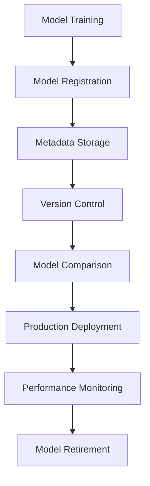

# Model Registry Documentation

The Model Registry provides comprehensive model versioning, metadata management, and lifecycle tracking for machine learning models. This system ensures reproducibility, enables model comparison, and supports production deployment workflows.

## 🏛️ Registry Overview

### Architecture



### Key Features

- **Version Control**: Automatic versioning with semantic versioning support
- **Metadata Management**: Comprehensive model and experiment metadata
- **Model Comparison**: Side-by-side performance comparison
- **Lifecycle Management**: Track model stages from development to retirement
- **Artifact Storage**: Secure storage of models, preprocessors, and metadata
- **Search and Discovery**: Advanced search and filtering capabilities

## 📁 Registry Structure

### Directory Layout

```
model_registry/
├── models/                          # Model artifacts
│   ├── logistic_v20260106_143557/   # Versioned model directory
│   │   ├── model.pkl               # Trained model
│   │   ├── preprocessor.pkl        # Preprocessing pipeline
│   │   ├── metadata.json           # Model metadata
│   │   ├── metrics.json            # Performance metrics
│   │   └── config.json             # Training configuration
│   └── xgboost_v20260106_144230/
├── experiments/                     # Experiment tracking
│   ├── exp_001_baseline/
│   └── exp_002_feature_eng/
├── metadata/                        # Global metadata
│   ├── model_lineage.json
│   └── experiment_history.json
└── registry.json                   # Registry index
```

## 🔧 ModelRegistry Class

### Initialization

```python
from save_load import ModelRegistry

# Initialize registry
registry = ModelRegistry(
    base_path="model_registry",
    auto_create=True,
    backup_enabled=True
)

# Check registry status
print(f"Registry path: {registry.base_path}")
print(f"Total models: {len(registry.list_models())}")
```

### Configuration Options

```python
class ModelRegistry:
    def __init__(
        self,
        base_path: str = "model_registry",
        auto_create: bool = True,
        backup_enabled: bool = True,
        compression: bool = True,
        encryption: bool = False
    ):
        """
        Initialize Model Registry.
        
        Args:
            base_path: Base directory for registry
            auto_create: Create directory structure if missing
            backup_enabled: Enable automatic backups
            compression: Compress model artifacts
            encryption: Encrypt sensitive data
        """
```

## 💾 Model Registration

### Basic Model Registration

```python
# Register a trained model
model_info = registry.register_model(
    model=trained_model,
    model_name="churn_predictor",
    model_type="logistic_regression",
    version="1.0.0",
    description="Baseline logistic regression model",
    tags=["baseline", "production-ready"]
)

print(f"Model registered with ID: {model_info['model_id']}")
print(f"Version: {model_info['version']}")
```

### Advanced Registration

```python
# Register with comprehensive metadata
model_info = registry.register_model(
    model=trained_model,
    preprocessor=preprocessor,
    model_name="churn_predictor_advanced",
    model_type="xgboost",
    version="2.1.0",
    description="XGBoost model with advanced feature engineering",
    tags=["advanced", "feature-engineering", "production"],
    metadata={
        "training_data": "dataset_v2.csv",
        "training_date": "2026-01-06",
        "training_duration": "45 minutes",
        "hyperparameters": {
            "n_estimators": 200,
            "max_depth": 6,
            "learning_rate": 0.1
        },
        "feature_count": 25,
        "training_samples": 8000,
        "validation_samples": 2000
    },
    metrics={
        "roc_auc": 0.851,
        "f1_score": 0.602,
        "precision": 0.584,
        "recall": 0.621,
        "accuracy": 0.818
    },
    requirements=["scikit-learn>=1.0.0", "xgboost>=1.5.0"],
    author="Data Science Team",
    stage="production"
)
```

### Batch Registration

```python
# Register multiple models from training results
training_results = [
    {"model": logistic_model, "name": "logistic", "metrics": logistic_metrics},
    {"model": rf_model, "name": "random_forest", "metrics": rf_metrics},
    {"model": xgb_model, "name": "xgboost", "metrics": xgb_metrics}
]

registered_models = registry.register_batch(
    models_data=training_results,
    base_version="1.0.0",
    experiment_name="model_comparison_exp_001",
    common_metadata={
        "dataset": "churn_dataset_v1.csv",
        "preprocessing": "standard_pipeline",
        "cv_folds": 5
    }
)
```

## 🔍 Model Discovery

### List All Models

```python
# Get all registered models
all_models = registry.list_models()

for model in all_models:
    print(f"ID: {model['model_id']}")
    print(f"Name: {model['name']} v{model['version']}")
    print(f"Type: {model['model_type']}")
    print(f"Stage: {model['stage']}")
    print(f"ROC-AUC: {model['metrics'].get('roc_auc', 'N/A')}")
    print("-" * 40)
```

### Search and Filter

```python
# Search by model type
xgboost_models = registry.search_models(
    model_type="xgboost",
    stage="production"
)

# Search by performance threshold
high_performance_models = registry.search_models(
    min_roc_auc=0.80,
    min_f1_score=0.60
)

# Search by tags
production_models = registry.search_models(
    tags=["production", "validated"],
    match_all_tags=True
)

# Advanced search with multiple criteria
filtered_models = registry.search_models(
    model_type=["xgboost", "lightgbm"],
    stage=["staging", "production"],
    created_after="2026-01-01",
    author="Data Science Team",
    min_roc_auc=0.75
)
```

### Query Builder

```python
# Use query builder for complex searches
query = registry.query_builder() \
    .model_type("xgboost") \
    .performance_above("roc_auc", 0.80) \
    .created_within_days(30) \
    .has_tags(["production-ready"]) \
    .build()

results = registry.execute_query(query)
```

## 📊 Model Comparison

### Compare Model Performance

```python
# Compare multiple models
model_ids = ["logistic_v1.0.0", "xgboost_v2.1.0", "rf_v1.5.0"]

comparison = registry.compare_models(
    model_ids=model_ids,
    metrics=["roc_auc", "f1_score", "precision", "recall"],
    include_metadata=True
)

# View comparison table
print(comparison.to_string())
```

### Performance Evolution

```python
# Track performance over versions
evolution = registry.get_performance_evolution(
    model_name="churn_predictor",
    metric="roc_auc",
    include_all_versions=True
)

# Plot evolution
registry.plot_performance_evolution(
    evolution_data=evolution,
    save_path="metrics/performance_evolution.png"
)
```

### Best Model Selection

```python
# Find best model by criteria
best_model = registry.get_best_model(
    model_type="xgboost",
    metric="roc_auc",
    stage="production",
    created_after="2026-01-01"
)

print(f"Best Model: {best_model['name']} v{best_model['version']}")
print(f"ROC-AUC: {best_model['metrics']['roc_auc']:.4f}")
```

## 🔄 Model Lifecycle Management

### Stage Management

```python
# Promote model to staging
registry.promote_model(
    model_id="xgboost_v2.1.0",
    target_stage="staging",
    approval_required=True,
    approver="ML Engineering Team"
)

# Promote to production
registry.promote_model(
    model_id="xgboost_v2.1.0",
    target_stage="production",
    deployment_config={
        "replicas": 3,
        "memory_limit": "2Gi",
        "cpu_limit": "1000m"
    }
)

# Retire old model
registry.retire_model(
    model_id="logistic_v1.0.0",
    reason="Replaced by better performing XGBoost model",
    retirement_date="2026-01-15"
)
```

### Version Management

```python
# Create new version
new_version = registry.create_version(
    base_model_id="xgboost_v2.1.0",
    version_type="patch",  # major, minor, patch
    changes=[
        "Updated hyperparameters",
        "Added new features",
        "Improved preprocessing"
    ]
)

# Get version history
version_history = registry.get_version_history(
    model_name="churn_predictor"
)

# Compare versions
version_comparison = registry.compare_versions(
    model_name="churn_predictor",
    version1="2.1.0",
    version2="2.2.0"
)
```

### Model Lineage

```python
# Track model lineage
lineage = registry.get_model_lineage(
    model_id="xgboost_v2.1.0",
    include_data_lineage=True,
    include_code_lineage=True
)

# Visualize lineage
registry.visualize_lineage(
    lineage_data=lineage,
    save_path="reports/model_lineage.png"
)
```

## 📥 Model Loading

### Load Model by ID

```python
# Load specific model version
model_data = registry.load_model(
    model_id="xgboost_v2.1.0",
    include_preprocessor=True,
    include_metadata=True
)

model = model_data['model']
preprocessor = model_data['preprocessor']
metadata = model_data['metadata']

# Make predictions
predictions = model.predict(preprocessor.transform(X_new))
```

### Load Best Model

```python
# Load best performing model
best_model_data = registry.load_best_model(
    model_type="xgboost",
    metric="roc_auc",
    stage="production"
)

# Load latest version
latest_model = registry.load_latest_model(
    model_name="churn_predictor",
    stage="production"
)
```

### Lazy Loading

```python
# Load model lazily (on first use)
lazy_model = registry.load_model_lazy(
    model_id="xgboost_v2.1.0"
)

# Model is loaded when first accessed
predictions = lazy_model.predict(X_new)
```

## 🔒 Model Security

### Access Control

```python
# Set model permissions
registry.set_model_permissions(
    model_id="xgboost_v2.1.0",
    permissions={
        "read": ["data_scientists", "ml_engineers"],
        "write": ["ml_engineers"],
        "deploy": ["devops_team"],
        "delete": ["admin"]
    }
)

# Check permissions
can_deploy = registry.check_permission(
    model_id="xgboost_v2.1.0",
    user="john.doe",
    action="deploy"
)
```

### Model Encryption

```python
# Enable encryption for sensitive models
registry.enable_encryption(
    model_id="xgboost_v2.1.0",
    encryption_key="your-encryption-key",
    encrypt_metadata=True
)

# Load encrypted model
encrypted_model = registry.load_encrypted_model(
    model_id="xgboost_v2.1.0",
    decryption_key="your-encryption-key"
)
```

### Audit Trail

```python
# Get model access history
audit_log = registry.get_audit_log(
    model_id="xgboost_v2.1.0",
    start_date="2026-01-01",
    end_date="2026-01-06"
)

# Track model usage
usage_stats = registry.get_usage_statistics(
    model_id="xgboost_v2.1.0",
    time_period="last_30_days"
)
```

## 📊 Registry Analytics

### Registry Statistics

```python
# Get registry overview
stats = registry.get_registry_statistics()

print(f"Total Models: {stats['total_models']}")
print(f"Active Models: {stats['active_models']}")
print(f"Production Models: {stats['production_models']}")
print(f"Storage Used: {stats['storage_used']}")
print(f"Average Model Size: {stats['avg_model_size']}")
```

### Performance Analytics

```python
# Analyze model performance trends
performance_trends = registry.analyze_performance_trends(
    time_period="last_6_months",
    metrics=["roc_auc", "f1_score"],
    group_by="model_type"
)

# Generate performance report
performance_report = registry.generate_performance_report(
    include_charts=True,
    save_path="reports/registry_performance_report.html"
)
```

### Usage Analytics

```python
# Model usage patterns
usage_patterns = registry.analyze_usage_patterns(
    time_period="last_month",
    group_by=["model_type", "stage", "user"]
)

# Popular models
popular_models = registry.get_popular_models(
    metric="download_count",
    time_period="last_week",
    top_n=10
)
```

## 🔄 Registry Maintenance

### Cleanup Operations

```python
# Clean up old versions
cleanup_result = registry.cleanup_old_versions(
    keep_versions=5,  # Keep last 5 versions
    exclude_production=True,
    dry_run=True  # Preview changes
)

# Remove unused models
unused_models = registry.find_unused_models(
    unused_days=90,
    exclude_stages=["production", "staging"]
)

registry.remove_unused_models(
    model_ids=unused_models,
    create_backup=True
)
```

### Registry Optimization

```python
# Optimize registry storage
optimization_result = registry.optimize_storage(
    compress_old_models=True,
    deduplicate_artifacts=True,
    archive_old_experiments=True
)

# Rebuild registry index
registry.rebuild_index(
    verify_integrity=True,
    update_statistics=True
)
```

### Backup and Restore

```python
# Create registry backup
backup_info = registry.create_backup(
    backup_path="backups/registry_backup_20260106.tar.gz",
    include_models=True,
    include_metadata=True,
    compress=True
)

# Restore from backup
registry.restore_from_backup(
    backup_path="backups/registry_backup_20260106.tar.gz",
    restore_models=True,
    restore_metadata=True,
    verify_integrity=True
)
```

## 🌐 Integration Features

### CI/CD Integration

```python
# Register model from CI/CD pipeline
def register_from_pipeline():
    """Register model from automated pipeline."""
    
    # Get build information
    build_info = {
        "build_id": os.environ.get("BUILD_ID"),
        "commit_hash": os.environ.get("GIT_COMMIT"),
        "branch": os.environ.get("GIT_BRANCH"),
        "build_url": os.environ.get("BUILD_URL")
    }
    
    # Register model with build metadata
    model_info = registry.register_model(
        model=trained_model,
        model_name="churn_predictor",
        version=f"auto-{build_info['build_id']}",
        metadata={
            "build_info": build_info,
            "automated": True,
            "pipeline": "training_pipeline_v2"
        },
        stage="staging"  # Auto-promote to staging
    )
    
    return model_info
```

### MLflow Integration

```python
# Sync with MLflow
registry.sync_with_mlflow(
    mlflow_tracking_uri="http://localhost:5000",
    experiment_name="churn_prediction",
    sync_direction="bidirectional"
)

# Import from MLflow
imported_models = registry.import_from_mlflow(
    experiment_ids=["1", "2", "3"],
    model_stage="Production"
)
```

### API Integration

```python
# REST API endpoints for registry
from fastapi import FastAPI
from save_load import ModelRegistryAPI

app = FastAPI()
registry_api = ModelRegistryAPI(registry)

# Add registry endpoints
app.include_router(
    registry_api.router,
    prefix="/api/v1/registry",
    tags=["model-registry"]
)

# Example endpoints:
# GET /api/v1/registry/models
# GET /api/v1/registry/models/{model_id}
# POST /api/v1/registry/models
# PUT /api/v1/registry/models/{model_id}/stage
```

## 📋 Best Practices

### 1. Naming Conventions
- Use descriptive model names: `churn_predictor_xgboost`
- Follow semantic versioning: `major.minor.patch`
- Use consistent tags: `production`, `staging`, `experimental`

### 2. Metadata Management
- Include comprehensive training metadata
- Document feature engineering steps
- Track data lineage and dependencies

### 3. Version Control
- Create new versions for significant changes
- Use patch versions for minor improvements
- Maintain clear change logs

### 4. Stage Management
- Use staging for validation before production
- Implement approval workflows for production
- Monitor production models continuously

### 5. Security
- Implement proper access controls
- Encrypt sensitive models
- Maintain audit trails

## 🔧 Troubleshooting

### Common Issues

**Registry Corruption**
```python
# Verify and repair registry
registry.verify_integrity(repair=True)
```

**Storage Issues**
```python
# Check storage usage
storage_info = registry.get_storage_info()
if storage_info['usage_percent'] > 90:
    registry.cleanup_old_versions(keep_versions=3)
```

**Performance Issues**
```python
# Optimize registry performance
registry.optimize_performance(
    rebuild_index=True,
    compress_models=True,
    cache_metadata=True
)
```

## 📚 Next Steps

- **API Documentation**: Deploy models via API in [09-api-documentation.md](09-api-documentation.md)
- **Preprocessing**: Advanced preprocessing in [10-preprocessing.md](10-preprocessing.md)
- **Deployment**: Production deployment in [12-deployment.md](12-deployment.md)

---

The Model Registry provides enterprise-grade model management with comprehensive versioning, metadata tracking, and lifecycle management capabilities for production machine learning systems.