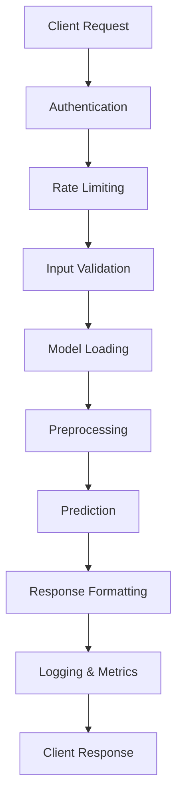

# API Documentation

The Customer Churn Prediction API provides RESTful endpoints for real-time predictions, model management, and system monitoring. Built with FastAPI, it offers automatic documentation, high performance, and production-ready features.

## 🚀 API Overview

### Key Features

- **Real-time Predictions**: Fast inference with confidence scores
- **Batch Processing**: Handle multiple predictions efficiently
- **Model Management**: Load, switch, and manage models dynamically
- **Health Monitoring**: Comprehensive health checks and metrics
- **Authentication**: Secure API access with token-based auth
- **Rate Limiting**: Protect against abuse and ensure fair usage
- **Automatic Documentation**: Interactive Swagger/OpenAPI docs

### Technology Stack

- **FastAPI**: Modern, fast web framework
- **Uvicorn**: High-performance ASGI server
- **Pydantic**: Data validation and serialization
- **JWT**: Secure authentication
- **Redis**: Caching and rate limiting
- **Prometheus**: Metrics collection

## 🏗️ API Architecture



## 🚀 Quick Start

### Starting the API Server

```bash
# Start the API server
python start_api.py

# Or with custom configuration
python start_api.py --host 0.0.0.0 --port 8000 --workers 4

# Using uvicorn directly
uvicorn start_api:app --host 0.0.0.0 --port 8000 --reload
```

### Server Configuration

```python
# start_api.py configuration
API_CONFIG = {
    "host": "0.0.0.0",
    "port": 8000,
    "workers": 4,
    "reload": False,
    "log_level": "info",
    "access_log": True,
    "model_path": "churn_model.pkl",
    "enable_auth": True,
    "enable_rate_limiting": True,
    "cache_predictions": True
}
```

### Health Check

```bash
# Check API health
curl http://localhost:8000/health

# Response
{
    "status": "healthy",
    "timestamp": "2026-01-06T14:35:57Z",
    "version": "1.0.0",
    "model_loaded": true,
    "uptime": "2h 15m 30s"
}
```

## 🔐 Authentication

### API Key Authentication

```python
# Include API key in headers
headers = {
    "X-API-Key": "your-api-key-here",
    "Content-Type": "application/json"
}

response = requests.post(
    "http://localhost:8000/predict",
    headers=headers,
    json=prediction_data
)
```

### JWT Token Authentication

```python
# Get access token
auth_response = requests.post(
    "http://localhost:8000/auth/token",
    data={
        "username": "your-username",
        "password": "your-password"
    }
)

token = auth_response.json()["access_token"]

# Use token for API calls
headers = {
    "Authorization": f"Bearer {token}",
    "Content-Type": "application/json"
}
```

### Creating API Keys

```python
# Create new API key
curl -X POST "http://localhost:8000/admin/api-keys" \
  -H "Authorization: Bearer admin-token" \
  -H "Content-Type: application/json" \
  -d '{
    "name": "production-client",
    "permissions": ["predict", "batch_predict"],
    "rate_limit": 1000,
    "expires_at": "2026-12-31T23:59:59Z"
  }'
```

## 🎯 Prediction Endpoints

### Single Prediction

```python
# POST /predict
import requests

# Customer data
customer_data = {
    "customer_id": "CUST_001",
    "gender": "Female",
    "senior_citizen": 0,
    "partner": "Yes",
    "dependents": "No",
    "tenure": 12,
    "phone_service": "Yes",
    "multiple_lines": "No",
    "internet_service": "DSL",
    "online_security": "Yes",
    "online_backup": "No",
    "device_protection": "Yes",
    "tech_support": "No",
    "streaming_tv": "No",
    "streaming_movies": "Yes",
    "contract": "Month-to-month",
    "paperless_billing": "Yes",
    "payment_method": "Electronic check",
    "monthly_charges": 65.75,
    "total_charges": 789.0
}

# Make prediction request
response = requests.post(
    "http://localhost:8000/predict",
    headers={"X-API-Key": "your-api-key"},
    json=customer_data
)

# Response
{
    "customer_id": "CUST_001",
    "prediction": 1,
    "probability": 0.742,
    "confidence": "high",
    "risk_level": "high",
    "model_version": "xgboost_v2.1.0",
    "prediction_time": "2026-01-06T14:35:57Z",
    "processing_time_ms": 15
}
```

### Batch Predictions

```python
# POST /predict/batch
batch_data = {
    "customers": [
        {
            "customer_id": "CUST_001",
            "gender": "Female",
            "tenure": 12,
            # ... other features
        },
        {
            "customer_id": "CUST_002",
            "gender": "Male",
            "tenure": 24,
            # ... other features
        }
    ],
    "return_probabilities": True,
    "return_explanations": False
}

response = requests.post(
    "http://localhost:8000/predict/batch",
    headers={"X-API-Key": "your-api-key"},
    json=batch_data
)

# Response
{
    "predictions": [
        {
            "customer_id": "CUST_001",
            "prediction": 1,
            "probability": 0.742,
            "confidence": "high"
        },
        {
            "customer_id": "CUST_002",
            "prediction": 0,
            "probability": 0.234,
            "confidence": "high"
        }
    ],
    "batch_id": "batch_20260106_143557",
    "total_predictions": 2,
    "processing_time_ms": 28,
    "model_version": "xgboost_v2.1.0"
}
```

### Prediction with Explanations

```python
# POST /predict/explain
explanation_request = {
    "customer_data": {
        "gender": "Female",
        "SeniorCitizen": 0,
        "Partner": "Yes",
        "Dependents": "No",
        "tenure": 12,
        "PhoneService": "Yes",
        "MultipleLines": "No",
        "InternetService": "DSL",
        "OnlineSecurity": "No",
        "OnlineBackup": "Yes",
        "DeviceProtection": "No",
        "TechSupport": "No",
        "StreamingTV": "No",
        "StreamingMovies": "No",
        "Contract": "Month-to-month",
        "PaperlessBilling": "Yes",
        "PaymentMethod": "Electronic check",
        "MonthlyCharges": 29.85,
        "TotalCharges": 358.2
    },
    "explanation_type": "shap",
    "top_features": 10
}

response = requests.post(
    "http://localhost:8000/predict/explain",
    headers={"X-API-Key": "your-api-key"},
    json=explanation_request
)

# Response
{
    "customer_id": "auto-generated",
    "prediction": 1,
    "probability": 0.742,
    "confidence": "high",
    "risk_factors": [
        "Short-term contract",
        "Low tenure",
        "Electronic check payment"
    ],
    "feature_importance": {
        "Contract": 0.234,
        "tenure": -0.187,
        "PaymentMethod": 0.156,
        "MonthlyCharges": 0.089,
        "InternetService": 0.067
    },
    "explanation": {
        "method": "shap",
        "base_value": 0.267,
        "shap_values": {
            "Contract": 0.234,
            "tenure": -0.187,
            "PaymentMethod": 0.156
        }
    }
}
```

## 🏋️ Training Endpoints

### Train Models

```python
# POST /train
training_config = {
    "models_to_train": ["logistic", "random_forest", "xgboost", "lightgbm"],
    "optimize_hyperparameters": True,
    "search_type": "random",
    "n_iter": 30,
    "use_ensemble": True,
    "advanced_preprocessing": True,
    "feature_engineering": True,
    "handle_imbalance": True,
    "experiment_name": "production_training_v1"
}

response = requests.post(
    "http://localhost:8000/train",
    headers={"X-API-Key": "your-api-key"},
    json=training_config
)

# Response
{
    "status": "started",
    "models_trained": [],
    "best_model": "pending",
    "best_score": 0.0,
    "training_time": 0.0,
    "message": "Training started in background. Check /train/status for progress."
}
```

### Training Status

```python
# GET /train/status
response = requests.get(
    "http://localhost:8000/train/status",
    headers={"X-API-Key": "your-api-key"}
)

# Response (during training)
{
    "status": "running",
    "progress": 65,
    "message": "Training XGBoost model with hyperparameter optimization...",
    "current_model": "xgboost",
    "models_completed": ["logistic", "random_forest"],
    "estimated_time_remaining": "5 minutes"
}

# Response (completed)
{
    "status": "completed",
    "progress": 100,
    "message": "Training completed successfully. Best model: xgboost",
    "best_model": "xgboost",
    "best_score": 0.8756,
    "training_time": 1247.5,
    "models_trained": ["logistic", "random_forest", "xgboost", "lightgbm"]
}
```

## 🎯 Model Management Endpoints

### List Models

```python
# GET /models
response = requests.get(
    "http://localhost:8000/models",
    headers={"X-API-Key": "your-api-key"}
)

# Response
{
    "models": [
        {
            "model_id": "xgboost_v20260106_143557",
            "model_name": "xgboost",
            "version": "v20260106_143557",
            "created_at": "2026-01-06T14:35:57Z",
            "val_roc_auc": 0.8756,
            "val_accuracy": 0.8234,
            "val_precision": 0.7891,
            "val_recall": 0.8123,
            "val_f1": 0.8005,
            "status": "active",
            "file_size_mb": 12.5
        },
        {
            "model_id": "random_forest_v20260106_143642",
            "model_name": "random_forest",
            "version": "v20260106_143642",
            "created_at": "2026-01-06T14:36:42Z",
            "val_roc_auc": 0.8634,
            "val_accuracy": 0.8156,
            "val_precision": 0.7723,
            "val_recall": 0.8045,
            "val_f1": 0.7881,
            "status": "archived"
        }
    ],
    "total_models": 2
}
```

### Compare Models

```python
# GET /models/compare?metric=val_roc_auc
response = requests.get(
    "http://localhost:8000/models/compare",
    headers={"X-API-Key": "your-api-key"},
    params={"metric": "val_roc_auc"}
)

# Response
{
    "comparison": [
        {
            "model_name": "xgboost",
            "val_roc_auc": 0.8756,
            "val_accuracy": 0.8234,
            "rank": 1
        },
        {
            "model_name": "random_forest",
            "val_roc_auc": 0.8634,
            "val_accuracy": 0.8156,
            "rank": 2
        },
        {
            "model_name": "logistic",
            "val_roc_auc": 0.8423,
            "val_accuracy": 0.7989,
            "rank": 3
        }
    ],
    "metric_used": "val_roc_auc",
    "best_model": {
        "model_name": "xgboost",
        "val_roc_auc": 0.8756,
        "val_accuracy": 0.8234,
        "rank": 1
    }
}
```

### Deploy Model

```python
# POST /models/{model_id}/deploy
response = requests.post(
    "http://localhost:8000/models/xgboost_v20260106_143557/deploy",
    headers={"X-API-Key": "your-api-key"}
)

# Response
{
    "status": "success",
    "message": "Model deployed successfully",
    "model_id": "xgboost_v20260106_143557",
    "deployment_time": "2026-01-06T14:45:23Z",
    "previous_model": "random_forest_v20260106_143642"
}
```

## 📊 Metrics and Monitoring Endpoints

### Model Performance Metrics

```python
# GET /metrics/comparison
response = requests.get(
    "http://localhost:8000/metrics/comparison",
    headers={"X-API-Key": "your-api-key"}
)

# Response
{
    "comparison": [
        {
            "Model": "XGBoost",
            "Val_ROC_AUC": 0.8756,
            "Val_Accuracy": 0.8234,
            "Val_Precision": 0.7891,
            "Val_Recall": 0.8123,
            "Val_F1": 0.8005,
            "Test_ROC_AUC": 0.8698,
            "Test_Accuracy": 0.8189,
            "Training_Time": 245.7
        }
    ],
    "summary": {
        "total_models": 4,
        "best_model": "XGBoost",
        "best_score": 0.8756
    }
}
```

### System Health and Performance

```python
# GET /health
response = requests.get("http://localhost:8000/health")

# Response
{
    "status": "healthy",
    "timestamp": "2026-01-06T14:35:57Z",
    "model_registry_status": "operational",
    "experiment_tracker_status": "operational",
    "uptime": "2h 15m 30s",
    "memory_usage": "1.2GB",
    "cpu_usage": "15%",
    "active_models": 1,
    "total_predictions": 15847,
    "avg_response_time_ms": 23
}
```

### API Metrics

```python
# GET /metrics/api
response = requests.get(
    "http://localhost:8000/metrics/api",
    headers={"X-API-Key": "your-api-key"}
)

# Response
{
    "total_requests": 15847,
    "requests_per_minute": 45.2,
    "avg_response_time_ms": 23,
    "error_rate": 0.002,
    "endpoints": {
        "/predict": {
            "requests": 14523,
            "avg_response_time_ms": 18,
            "error_rate": 0.001
        },
        "/predict/batch": {
            "requests": 892,
            "avg_response_time_ms": 156,
            "error_rate": 0.003
        },
        "/train": {
            "requests": 23,
            "avg_response_time_ms": 2340,
            "error_rate": 0.043
        }
    }
}
```

## 🔧 Data Schemas

### Customer Data Schema

```json
{
    "type": "object",
    "properties": {
        "gender": {
            "type": "string",
            "enum": ["Male", "Female"],
            "description": "Customer gender"
        },
        "SeniorCitizen": {
            "type": "integer",
            "minimum": 0,
            "maximum": 1,
            "description": "Senior citizen flag (0/1)"
        },
        "Partner": {
            "type": "string",
            "enum": ["Yes", "No"],
            "description": "Has partner"
        },
        "Dependents": {
            "type": "string",
            "enum": ["Yes", "No"],
            "description": "Has dependents"
        },
        "tenure": {
            "type": "integer",
            "minimum": 0,
            "description": "Months with company"
        },
        "PhoneService": {
            "type": "string",
            "enum": ["Yes", "No"],
            "description": "Has phone service"
        },
        "MultipleLines": {
            "type": "string",
            "enum": ["Yes", "No", "No phone service"],
            "description": "Multiple lines"
        },
        "InternetService": {
            "type": "string",
            "enum": ["DSL", "Fiber optic", "No"],
            "description": "Internet service type"
        },
        "OnlineSecurity": {
            "type": "string",
            "enum": ["Yes", "No", "No internet service"],
            "description": "Online security"
        },
        "OnlineBackup": {
            "type": "string",
            "enum": ["Yes", "No", "No internet service"],
            "description": "Online backup"
        },
        "DeviceProtection": {
            "type": "string",
            "enum": ["Yes", "No", "No internet service"],
            "description": "Device protection"
        },
        "TechSupport": {
            "type": "string",
            "enum": ["Yes", "No", "No internet service"],
            "description": "Tech support"
        },
        "StreamingTV": {
            "type": "string",
            "enum": ["Yes", "No", "No internet service"],
            "description": "Streaming TV"
        },
        "StreamingMovies": {
            "type": "string",
            "enum": ["Yes", "No", "No internet service"],
            "description": "Streaming movies"
        },
        "Contract": {
            "type": "string",
            "enum": ["Month-to-month", "One year", "Two year"],
            "description": "Contract type"
        },
        "PaperlessBilling": {
            "type": "string",
            "enum": ["Yes", "No"],
            "description": "Paperless billing"
        },
        "PaymentMethod": {
            "type": "string",
            "enum": [
                "Electronic check",
                "Mailed check",
                "Bank transfer (automatic)",
                "Credit card (automatic)"
            ],
            "description": "Payment method"
        },
        "MonthlyCharges": {
            "type": "number",
            "minimum": 0,
            "description": "Monthly charges in dollars"
        },
        "TotalCharges": {
            "type": ["number", "string"],
            "description": "Total charges (numeric or string)"
        }
    },
    "required": [
        "gender", "SeniorCitizen", "Partner", "Dependents", "tenure",
        "PhoneService", "MultipleLines", "InternetService", "OnlineSecurity",
        "OnlineBackup", "DeviceProtection", "TechSupport", "StreamingTV",
        "StreamingMovies", "Contract", "PaperlessBilling", "PaymentMethod",
        "MonthlyCharges", "TotalCharges"
    ]
}
```

## 🚨 Error Handling

### Error Response Format

```json
{
    "detail": "Error message describing what went wrong",
    "error_code": "PREDICTION_FAILED",
    "timestamp": "2026-01-06T14:35:57Z",
    "request_id": "req_123456789"
}
```

### Common Error Codes

| Code | Status | Description |
|------|--------|-------------|
| `INVALID_INPUT` | 400 | Invalid input data format |
| `MISSING_FEATURES` | 400 | Required features missing |
| `MODEL_NOT_LOADED` | 503 | Model not available |
| `PREDICTION_FAILED` | 500 | Prediction processing error |
| `TRAINING_IN_PROGRESS` | 409 | Training already running |
| `UNAUTHORIZED` | 401 | Invalid API key or token |
| `RATE_LIMIT_EXCEEDED` | 429 | Too many requests |
| `MODEL_NOT_FOUND` | 404 | Requested model doesn't exist |

### Error Examples

```python
# Invalid input data
{
    "detail": "Invalid value for field 'tenure': must be >= 0",
    "error_code": "INVALID_INPUT",
    "timestamp": "2026-01-06T14:35:57Z",
    "request_id": "req_123456789"
}

# Model not loaded
{
    "detail": "No model is currently loaded for predictions",
    "error_code": "MODEL_NOT_LOADED",
    "timestamp": "2026-01-06T14:35:57Z",
    "request_id": "req_123456790"
}

# Rate limit exceeded
{
    "detail": "Rate limit exceeded: 1000 requests per hour",
    "error_code": "RATE_LIMIT_EXCEEDED",
    "timestamp": "2026-01-06T14:35:57Z",
    "request_id": "req_123456791",
    "retry_after": 3600
}
```

## 🔄 Rate Limiting

### Rate Limit Headers

All API responses include rate limiting headers:

```http
X-RateLimit-Limit: 1000
X-RateLimit-Remaining: 999
X-RateLimit-Reset: 1641484557
X-RateLimit-Window: 3600
```

### Rate Limit Tiers

| Tier | Requests/Hour | Batch Size | Features |
|------|---------------|------------|----------|
| Free | 100 | 10 | Basic predictions |
| Pro | 1,000 | 100 | All features |
| Enterprise | 10,000 | 1,000 | Custom limits |

## 📈 Performance Optimization

### Caching

The API implements intelligent caching:

```python
# Enable caching for predictions
headers = {
    "X-API-Key": "your-api-key",
    "X-Cache-TTL": "300"  # Cache for 5 minutes
}

# Cache hit response includes header
# X-Cache-Status: HIT
```

### Batch Processing Tips

```python
# Optimal batch sizes
batch_sizes = {
    "small_instances": 50,    # < 2GB RAM
    "medium_instances": 200,  # 2-8GB RAM  
    "large_instances": 500    # > 8GB RAM
}

# Async batch processing
async def process_large_batch(customers):
    batch_size = 100
    results = []
    
    for i in range(0, len(customers), batch_size):
        batch = customers[i:i + batch_size]
        response = await async_predict_batch(batch)
        results.extend(response["predictions"])
    
    return results
```

## 🔍 Monitoring and Logging

### Request Logging

```python
# Enable detailed logging
headers = {
    "X-API-Key": "your-api-key",
    "X-Request-ID": "unique-request-id",
    "X-Log-Level": "DEBUG"
}
```

### Metrics Collection

```python
# Custom metrics endpoint
response = requests.get(
    "http://localhost:8000/metrics/custom",
    headers={"X-API-Key": "your-api-key"},
    params={
        "start_time": "2026-01-06T00:00:00Z",
        "end_time": "2026-01-06T23:59:59Z",
        "metrics": ["predictions", "errors", "latency"]
    }
)
```

## 🧪 Testing the API

### Using curl

```bash
# Health check
curl -X GET "http://localhost:8000/health"

# Make prediction
curl -X POST "http://localhost:8000/predict" \
  -H "X-API-Key: your-api-key" \
  -H "Content-Type: application/json" \
  -d '{
    "gender": "Female",
    "SeniorCitizen": 0,
    "Partner": "Yes",
    "Dependents": "No",
    "tenure": 12,
    "PhoneService": "Yes",
    "MultipleLines": "No",
    "InternetService": "DSL",
    "OnlineSecurity": "No",
    "OnlineBackup": "Yes",
    "DeviceProtection": "No",
    "TechSupport": "No",
    "StreamingTV": "No",
    "StreamingMovies": "No",
    "Contract": "Month-to-month",
    "PaperlessBilling": "Yes",
    "PaymentMethod": "Electronic check",
    "MonthlyCharges": 29.85,
    "TotalCharges": 358.2
  }'
```

### Using Python requests

```python
import requests
import json

# API configuration
API_BASE_URL = "http://localhost:8000"
API_KEY = "your-api-key"

headers = {
    "X-API-Key": API_KEY,
    "Content-Type": "application/json"
}

# Test prediction
customer_data = {
    "gender": "Female",
    "SeniorCitizen": 0,
    "Partner": "Yes",
    "Dependents": "No",
    "tenure": 12,
    "PhoneService": "Yes",
    "MultipleLines": "No",
    "InternetService": "DSL",
    "OnlineSecurity": "No",
    "OnlineBackup": "Yes",
    "DeviceProtection": "No",
    "TechSupport": "No",
    "StreamingTV": "No",
    "StreamingMovies": "No",
    "Contract": "Month-to-month",
    "PaperlessBilling": "Yes",
    "PaymentMethod": "Electronic check",
    "MonthlyCharges": 29.85,
    "TotalCharges": 358.2
}

response = requests.post(
    f"{API_BASE_URL}/predict",
    headers=headers,
    json=customer_data
)

if response.status_code == 200:
    result = response.json()
    print(f"Churn Prediction: {result['churn']}")
    print(f"Probability: {result['churn_probability']:.3f}")
    print(f"Confidence: {result['confidence']}")
    print(f"Risk Factors: {', '.join(result['risk_factors'])}")
else:
    print(f"Error: {response.status_code} - {response.text}")
```

### Load Testing

```python
import asyncio
import aiohttp
import time

async def load_test(num_requests=100):
    """Simple load test for the API."""
    
    async with aiohttp.ClientSession() as session:
        tasks = []
        start_time = time.time()
        
        for i in range(num_requests):
            task = session.post(
                "http://localhost:8000/predict",
                headers={"X-API-Key": "your-api-key"},
                json=customer_data
            )
            tasks.append(task)
        
        responses = await asyncio.gather(*tasks)
        end_time = time.time()
        
        success_count = sum(1 for r in responses if r.status == 200)
        total_time = end_time - start_time
        
        print(f"Load Test Results:")
        print(f"Total Requests: {num_requests}")
        print(f"Successful: {success_count}")
        print(f"Failed: {num_requests - success_count}")
        print(f"Total Time: {total_time:.2f}s")
        print(f"Requests/Second: {num_requests/total_time:.2f}")

# Run load test
asyncio.run(load_test(100))
```

## 📚 Interactive Documentation

### Swagger UI

Access the interactive API documentation at:
- **Swagger UI**: `http://localhost:8000/docs`
- **ReDoc**: `http://localhost:8000/redoc`

### OpenAPI Specification

Download the OpenAPI spec:
```bash
curl http://localhost:8000/openapi.json > api_spec.json
```